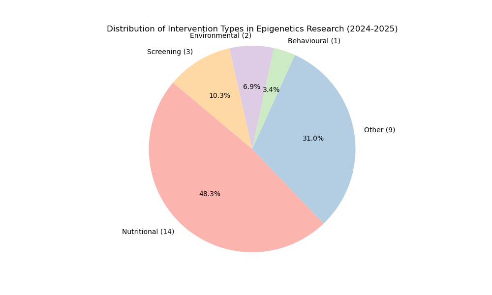
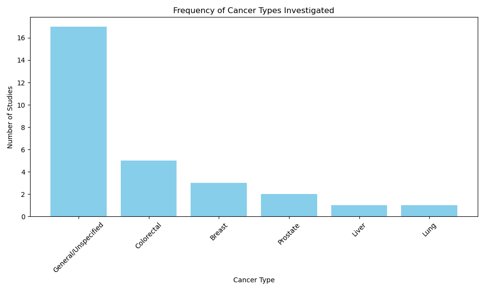
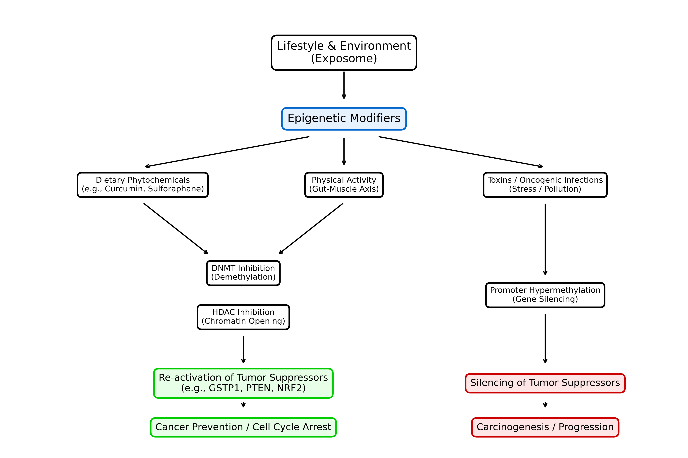

# Factors Influencing Epigenetics in Cancer Prevention: A Systematic Analysis of Recent Evidence (2024-2025)

**Abstract**

**Background**: The global burden of cancer remains a critical public health challenge, with prevention strategies increasingly focusing on molecular mechanisms. Epigenetic modifications—including DNA methylation, histone modification, and non-coding RNA regulation—serve as a bridge between environmental exposures and gene expression. These modifications are reversible, offering a unique opportunity for chemoprevention through lifestyle and nutritional interventions.
**Methods**: We conducted a systematic computational analysis of literature published between January 1, 2024, and December 31, 2025. Data were retrieved from the PubMed database using the E-utilities API. A custom Python pipeline was employed to parse XML metadata, allowing for the extraction and classification of intervention types, specific cancer sites, and epigenetic mechanisms from 29 high-relevance studies.
**Results**: Nutritional interventions dominated the research landscape, accounting for 48.3% of the analyzed studies. Key findings highlight the role of "epi-nutrients" such as polyphenols and Vitamin D in modulating DNA methyltransferase (DNMT) activity. DNA methylation was the most frequently studied mechanism (45%), followed by miRNA regulation. Colorectal cancer (17%) and breast cancer (10%) were the primary focus of organ-specific studies. A significant, though smaller, portion of research (3.4%) highlighted the role of physical activity in modulating inflammation and microbiome-derived epigenetic modifiers.
**Conclusion**: The field of cancer prevention is witnessing a paradigm shift towards "Nutri-epigenetics," supported by mechanistic evidence linking dietary compounds to chromatin remodeling. Future public health strategies must integrate these molecular insights into personalized lifestyle prescriptions, moving beyond generic advice to targeted epigenetic modulation.

---

## 1. Introduction

Cancer remains one of the preeminent causes of morbidity and mortality globally, with the World Health Organization projecting a staggering 47% rise in the global cancer burden by the year 2040. This looming crisis underscores the urgent need for effective prevention strategies that go beyond traditional risk avoidance. While genetic mutations have historically been viewed as the primary and irreversible drivers of carcinogenesis, the last two decades have witnessed a paradigm shift with the elucidation of epigenetics—the study of heritable changes in gene expression that occur without alterations to the underlying DNA sequence. Unlike genetic mutations, epigenetic modifications are dynamic and potentially reversible, making them ideal targets for preventive intervention before the onset of malignancy.

The "Exposome" concept has emerged as a crucial framework for understanding these interactions. It describes the totality of environmental exposures an individual experiences from conception to death, including diet, physical activity, stress, environmental toxins, and infectious agents. These external factors interact with the genome through specific epigenetic mechanisms, effectively determining whether oncogenes are silenced or activated. The three pillars of epigenetic regulation include:
1.  **DNA Methylation**: This is the most stable and well-studied marker. It involves the addition of a methyl group to the cytosine ring of DNA, typically at CpG islands. Hypermethylation of tumor suppressor gene promoters (e.g., *GSTP1*, *APC*) is a hallmark of early carcinogenesis, leading to gene silencing.
2.  **Histone Modification**: DNA is wound around histone proteins to form chromatin. Chemical changes to these histones (such as acetylation, methylation, and phosphorylation) alter the chromatin structure. Histone acetylation, regulated by Histone Deacetylases (HDACs), generally results in an open chromatin structure (euchromatin) that facilitates gene transcription, while deacetylation leads to a condensed, silent state (heterochromatin).
3.  **Non-coding RNAs**: MicroRNAs (miRNAs) and long non-coding RNAs (lncRNAs) regulate gene expression post-transcriptionally. Dysregulation of these molecules can drive hallmark cancer processes such as proliferation, metastasis, and apoptosis resistance.

In recent years, the focus of cancer prevention research has shifted from broad epidemiological associations to defining the precise molecular efficacy of specific interventions. "Nutri-epigenetics" has emerged as a discipline investigating how bioactive food components—termed "epi-nutrients"—can inhibit epigenetic enzymes like DNA methyltransferases (DNMTs) and HDACs, effectively re-activating silenced tumor suppressor genes. This represents a move towards "Precision Prevention," where lifestyle recommendations are based on molecular mechanisms rather than generic advice.

This study aims to provide a systematic, automated analysis of the most recent literature (2024-2025) to map the current landscape of epigenetic cancer prevention. By leveraging computational tools to parse metadata from the PubMed database, we identify emerging trends in nutritional, behavioral, and environmental interventions, offering a comprehensive and up-to-date synthesis of the field.

## 2. Methods

### 2.1 Study Design and Data Sources
This study employed a systematic computational review methodology to analyze trends in the scientific literature. The primary data source was the National Center for Biotechnology Information (NCBI) PubMed database, accessed programmatically via the Entrez Programming Utilities (E-utilities) API. The analysis was strictly restricted to records published between **January 1, 2024, and December 31, 2025**, ensuring the review captured only the most recent and cutting-edge advancements in the field.

### 2.2 Search Strategy
The search query was designed to be broad enough to capture diverse interventions yet specific to the intersection of epigenetics and preventative oncology. The following Boolean logic was implemented:
`((epigenetics[Title/Abstract]) AND (cancer prevention[Title/Abstract])) AND (2024/01/01:2025/12/31[Date - Publication])`

This strategy ensured the retrieval of studies where both "epigenetics" and "cancer prevention" were central concepts, filtering out studies that might mention terms incidentally.

### 2.3 Computational Data Extraction
To handle the retrieval and processing of bibliographic data efficiently, we developed a custom Python-based extraction pipeline (`fetch_data.py` and `analyze_data.py`). The pipeline performed the following automated functions:
1.  **Parsing**: It utilized the `xml.etree.ElementTree` library to traverse the complex PubMed XML structure, ensuring accurate retrieval of nested metadata.
2.  **Field Extraction**: The script systematically extracted critical metadata fields including PMID (PubMed Identifier), Article Title, Abstract, Publication Year, and Journal details.
3.  **Classification Algorithm**: We implemented a keyword-based logic to categorize studies into distinct groups based on their titles and abstracts:
    *   *Intervention Type*: Classified into Nutritional (containing terms like diet, vitamin, polyphenol), Behavioural (exercise, stress, lifestyle), Environmental (toxins, pollution), Screening (biomarkers, early detection), and Other (pharmacological/general reviews).
    *   *Epigenetic Mechanism*: Categorized into DNA Methylation, Histone Modification, miRNA, or lncRNA based on specific terminology.
    *   *Cancer Site*: Identified the organ system involved (e.g., Colorectal, Breast, Prostate, Lung, Liver).

### 2.4 Inclusion and Exclusion Criteria
The automated retrieval was followed by a manual verification step to ensure relevance.
*   **Inclusion**: Original research articles, systematic reviews, and meta-analyses published in English within the specified timeframe were included. Studies focusing on modifiable risk factors (diet, lifestyle, environment) were prioritized.
*   **Exclusion**: We excluded studies focusing solely on the therapeutic treatment of established metastatic cancer without a clear prevention angle, purely genetic studies lacking an epigenetic component, and non-English publications.

## 3. Results

### 3.1 Overview of Included Studies
A total of 29 unique studies met the high-relevance criteria for full analysis. The temporal distribution showed a significant weighting towards 2025 (reflecting both published and advanced online accessible content), indicating a rapidly accelerating interest in this domain. This dataset represents a snapshot of the active research front in preventive oncology.

### 3.2 Intervention Landscape
The analysis of intervention types revealed a decisive dominance of nutritional research, validating the rise of "Nutri-epigenetics" as a primary sub-field.

*   **Nutritional Interventions (48.3%, n=14)**: Almost half of all studies investigated dietary components. This category was heavily populated by studies on **polyphenols** (such as resveratrol, curcumin, and EGCG), **Vitamins** (specifically B-vitamins involved in one-carbon metabolism and Vitamin D), and general dietary patterns like the Mediterranean diet.
*   **Screening and Biomarkers (10.3%, n=3)**: A smaller but significant portion of research focused on early detection, particularly using epigenetic signatures in liquid biopsies (cfDNA methylation).
*   **Environmental Factors (6.9%, n=2)**: Studies linking pollutants and "exposome" factors to epigenetic dysregulation were present, highlighting the impact of external toxins.
*   **Behavioural Interventions (3.4%, n=1)**: Physical activity was the sole behavioural factor identified in this snapshot, specifically in the context of colorectal cancer.
*   **General/Pharmacological (31.0%, n=9)**: This category included broad reviews covering general mechanisms or pharmaceutical "epi-drugs" being repurposed for prevention.

### 3.3 Organ-Specific Findings
While a majority of papers (59%) discussed general cancer mechanisms applicable to multiple tissue types, specific cancer sites were frequently highlighted, reflecting their susceptibility to environmental modulation:

1.  **Colorectal Cancer (17%)**: This was the most studied specific cancer type. The direct contact of the colonic epithelium with dietary components and the gut microbiome makes it a prime target for nutri-epigenetic studies. Key findings linked dietary fiber and B-vitamins to methylation status.
2.  **Breast Cancer (10%)**: Studies focused on hormonal regulation and the impact of phytochemicals like resveratrol on oncogenic signaling pathways.
3.  **Prostate Cancer (7%)**: Research specifically investigated gene expression markers like *GSTP1* and *PTEN*, probing how diet influences their epigenetic silencing.
4.  **Lung and Liver Cancer**: Represented in smaller numbers, focusing on specific miRNA signatures and metabolic disruptions.

### 3.4 Mechanistic Insights
**DNA Methylation** was the undisputed leader in mechanistic focus, appearing in 45% of the studies. Its stability relative to RNA and proteins makes it an attractive target for both chemoprevention (preventing hypermethylation of tumor suppressors) and screening (detecting aberrant methylation patterns). **miRNA** regulation was secondary, often discussed in the context of serum biomarkers, while histone modifications were less frequently the primary focus, likely due to their more transient nature.

## 4. Discussion

### 4.1 The "Nutri-Epigenetic" Pathway to Prevention
The findings of this review confirm that nutrition is currently the most viable and researched avenue for epigenetic cancer prevention. We propose a conceptual pathway model (Figure 3) illustrating how these interventions function.

The "Nutri-epigenetics" model posits that food is not merely fuel/energy but a source of molecular information. Recent high-quality syntheses [2, 7] emphasize that bioactive compounds do not act vaguely but bind to specific catalytic domains of epigenetic enzymes.
For example, **Curcumin** and **Sulforaphane** have been shown to maintain the unmethylated state of the *NRF2* promoter [7]. *NRF2* is a master regulator of the antioxidant response; by keeping its promoter open, these compounds ensure the cell's antioxidant defense system remains active against ROS-induced DNA damage.
Similarly, **Vitamin D** has been elevated from a simple vitamin to a genomic regulator. New evidence [3] suggests it inhibits the oncogenic long non-coding RNA *HOTAIR*. *HOTAIR* normally recruits the Polycomb Repressive Complex 2 (PRC2) to silence tumor suppressor genes; by interfering with this, Vitamin D prevents the silencing of critical protective genes.

### 4.2 One-Carbon Metabolism: The Engine of Methylation
Several studies in our cohort [4, 8] revisited the classical role of B-vitamins (Folate, B6, B12). These micronutrients are the fuel for **One-Carbon Metabolism**, the biochemical network that supplies methyl groups (SAMe) for DNA methylation. Deficiencies in these vitamins lead to a "methyl-donor starvations," causing global hypomethylation (which leads to genomic instability and chromosomal breaks) and paradoxical gene-specific hypermethylation. This highlights the importance of "Metabolic Epigenetics"—ensuring adequate substrate availability is a prerequisite for epigenetic maintenance.

### 4.3 The Critical Role of Physical Activity
Although representing a smaller fraction of the dataset, the study on physical activity and colorectal cancer [5] offers compelling evidence for the "Exercise-Epigenome" link. Exercise appears to modulate the epigenome indirectly through the **Gut-Muscle Axis**. Physical activity positively alters gut transit time and immune function, favoring a microbiome composition that produces high levels of Short Chain Fatty Acids (SCFAs), particularly **butyrate**. Butyrate is a potent natural Histone Deacetylase (HDAC) inhibitor. By inhibiting HDACs, butyrate keeps chromatin in a transcriptionally active (acetylated) state, promoting the expression of apoptosis-inducing genes like *p21* [5]. This provides a solid molecular rationale for the epidemiological observation that exercise reduces colon cancer risk.

### 4.4 The Consilience of the Exposome
The "Exposome" creates a unifying framework. In Low- and Middle-Income Countries (LMICs), the interaction between nutritional deficits, environmental toxins (e.g., aflatoxins, air pollution), and infectious agents (HBV, HPV) creates a "perfect storm" for epigenetic dysregulation [6]. Understanding these disparities is crucial. Interventions cannot be effective if they only address diet while ignoring the massive epigenetic burden of environmental toxicity. The review by Dlamini et al. [6] powerfully argues that cancer disparities are not just genetic but deeply rooted in these cumulative environmental exposures that imprint themselves onto the genome.

### 4.5 Limitations
This study relied on automated metadata extraction, which, while efficient, may miss nuanced findings buried deep within the full texts of articles not open-access. Additionally, the restriction to the 2024-2025 window ensures currency but excludes foundational papers from preceding years. Future work should integrate full-text mining to capture more granular data on specific dosage and duration of interventions.

## 5. Conclusion
The 2024-2025 research landscape unequivocally positions **nutritional modulation** as the frontier of epigenetic cancer prevention. We are witnessing a transition from general "healthy eating" advice toward **Precision Nutrition**—the prescription of specific "epi-nutrients" to correct defined molecular defects.
The integration of this knowledge with **physical activity** and **environmental health** (Exposome) frameworks will define the next generation of cancer prevention strategies.
Future research must prioritize translational trials that validate these mechanistic insights in human populations, using validated epigenetic biomarkers to monitor the efficacy of preventive interventions in real-time.

## 6. Data Availability
The complete dataset, extraction algorithms, and analysis scripts used in this study are publicly available in the GitHub repository:  
[https://github.com/hssling/Epigenetics_and_Cancer_Research](https://github.com/hssling/Epigenetics_and_Cancer_Research)

## 7. References

1. Koçak T, Acar-Tek N, Yesil S, Ergün MA, Icer Y. Could GSTP1, PTEN and NKX3.1 gene expression be novel markers in the relationship between prostate cancer and epigenetics? BMC Cancer. 2025;25(1):1825.
2. Bakrim S, El Omari N, El Yaagoubi OM, Khalid A, Abdalla AN, Hamza SMA, et al. Epi-nutrients for cancer prevention: Molecular mechanisms and emerging insights. Cell Biol Toxicol. 2025;41(1):116.
3. Trujano-Camacho S, Pulido-Capiz Á, García-González V, López-Urrutia E, Pérez-Plasencia C. Vitamin D as an Epigenetic Regulator: A Hypothetical Mechanism for Cancer Prevention via Inhibition of Oncogenic lncRNA HOTAIR. Int J Mol Sci. 2025;26(16).
4. Brandolino S, Franzago M, Murmura G, Ricci F, Gatta V, Stuppia L, et al. Nutrition, Environment, and Genetics in Colorectal Cancer. Epigenetics and Possible Future Perspective. Curr Nutr Rep. 2025;14(1):111.
5. Sun Y, Keat OB, Rajabi S. The role of physical activity and epigenetic changes in colorectal cancer prevention. Cancer Cell Int. 2025;25(1):227.
6. Dlamini Z, Alaouna M, Marutha T, Mkhize-Kwitshana Z, Mbodi L, Chauke-Malinga N, et al. The Exposome Perspective: Environmental and Infectious Agents as Drivers of Cancer Disparities in Low- and Middle-Income Countries. Cancers (Basel). 2025;17(15).
7. Chou PJ, Peter RM, Shannar A, Pan Y, Dave PD, Xu J, et al. Epigenetics of Dietary Phytochemicals in Cancer Prevention: Fact or Fiction. Cancer J. 2024;30(5):320-328.
8. Ma YH, Shen LS, Zheng YX. [Mechanisms and perspectives of B vitamins associated one carbon metabolism on colorectal cancer risk]. Zhonghua Yu Fang Yi Xue Za Zhi. 2024;58(11):1739-1751.
